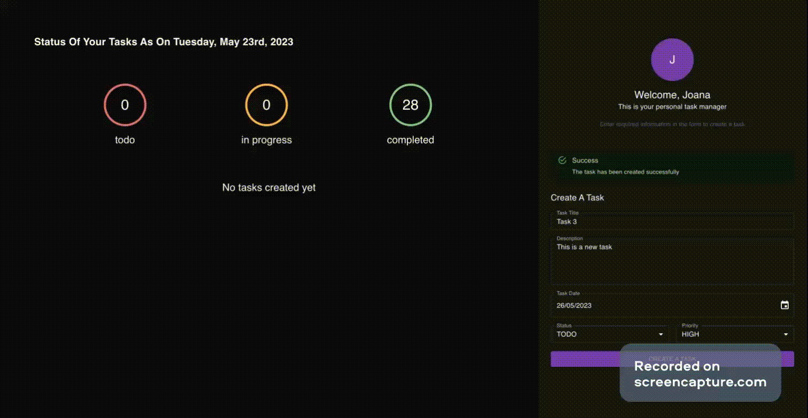

# Task Manager Project by Joana Mastianica

## About The Project

This project purpose was to practice Typescript, React, Node.js & mySql database.
Additionally, this project was a great practice for learning some new libraries, such as React Queries for data fetching and mutations and TypeORM library to connect to mySql database and make queries using a clean object relational model. 

<br>

## Project Functionalities

* Create new task
* Update created task status (from "to do" ---> "in progress")
* Mark task as completed
* Task counters by task status

*Note: Project Gif added to see functionality of a project.*

<br>

## Application example

<br>



<br>

## Techonologies Used 

<br>

### Front-end

* Typescript
* React framework
* Material UI for styling & styled components
* Axios & React Queries for data fetching & mutations
* Eslint for code problems active spotting
* Prettier for code formatting

### Back-end

* Node.js (v16.17.1)
* Express.js server
* Cors for approving cross-origin HTTP requests
* MySql database
* TypeORM for using clean object relational model

*Note: Tools and libraries used in this project are not a complete list of total knowledge acquired.*

<br>

## To Run Application 
<br>

1. Save the project to your local enviroment from my [github repository.](https://github.com/JoanaMas/fullstack-typescript-task-manager)

<br>

2. Open terminal on [server folder](./server) & run these commands in order by separately opening server & client folders to new window of your code editor:<br><br>


Install libraries:

```
npm install
```

Run server:

```
npm run server
```

3. Open terminal on [client folder](./client/react-task-manager) & run these commands in order:<br><br>

Install libraries:

```
npm install
```

Run application:

```
npm run start
```

<br>

# View code:

You can view code of application in [Online GitHub Editor](https://github.dev/JoanaMas/fullstack-typescript-task-manager).

<br>
# Note

Please note, that dotenv file (.env) added as a public file in order to be able to connect to database with provided credentials. Originally, this file should be git ignored for safety reasons & never publicly shared, but for purpose of application's functionality evaluation it was stored in my application's repository.
